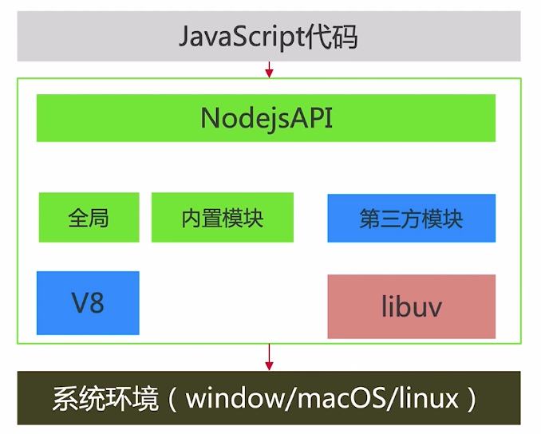
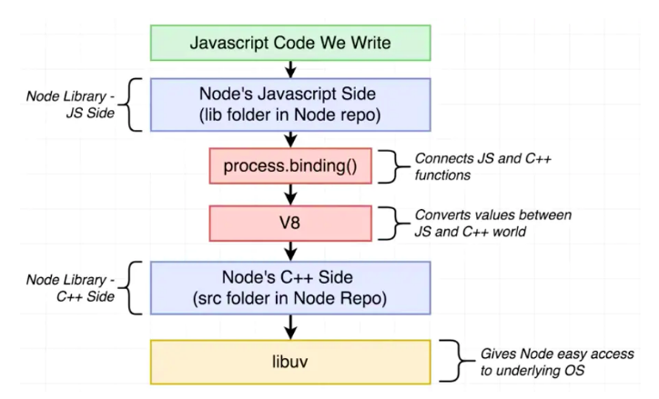

# Node 
## 简介
+ [基于Chrome V8引擎的javascript运行环境(Node.js® is a JavaScript runtime built on Chrome's V8 JavaScript engine.摘自nodejs官网)](https://nodejs.org/en/)
+ node中模块是什么
   - 在node中，一个文件就相当于是一个模块
## 架构&&内部运行机制
### Node架构方式
#### 架构图


#### 针对与架构图的解释(主要分为三部分)
##### 第一部分 Javascript代码
1. JavaScript代码(我们写的)会去调用Node.js对外开放的api接口
##### 第二部分 NodejsAPI
1. Node对外的api由全局模块、内置模块、第三方模块提供
2. Node.js集成了两个核心的模块
   + V8: V8是一个由Google开发的开源JavaScript引擎。是javascript代码和C++代码之间的桥梁。如:V8 用于将我们在不同程序中的写的 JS 类型的值，如 Boolean值、false值、null值、object值等转换成C++中的值
   + libuv:类似于一个开发包，主要负责的功能是
       - 异步I/O:例如文件的读取，Http请求处理
       - 事件驱动，之前了解过，Js是以事件进行驱动的
##### 第三部分 系统环境
1. node.js需要调用到系统
### Node.js是如何运行的
#### 运行原理图


##### 举个栗子

+ 就拿 **scrypt.js** 来讲

+ 源码scrypt.js(node-v12.14.1/lib/internal/crypto/scrypt.js)
```javascript
'use strict';

// Process.binding / InternalBinding 实际上是C++函数，是用于将Node标准库中C++端和Javascript端连接起来的桥梁。
const { AsyncWrap, Providers } = internalBinding('async_wrap');
const { Buffer } = require('buffer');
const { scrypt: _scrypt } = internalBinding('crypto');
const { validateInteger, validateUint32 } = require('internal/validators');
const {
  ERR_CRYPTO_SCRYPT_INVALID_PARAMETER,
  ERR_CRYPTO_SCRYPT_NOT_SUPPORTED,
  ERR_INVALID_CALLBACK
} = require('internal/errors').codes;
const {
  getDefaultEncoding,
  getArrayBufferView,
} = require('internal/crypto/util');

const defaults = {
  N: 16384,
  r: 8,
  p: 1,
  maxmem: 32 << 20,  // 32 MB, matches SCRYPT_MAX_MEM.
};

function scrypt(password, salt, keylen, options, callback = defaults) {
  if (callback === defaults) {
    callback = options;
    options = defaults;
  }

  options = check(password, salt, keylen, options);
  const { N, r, p, maxmem } = options;
  ({ password, salt, keylen } = options);

  if (typeof callback !== 'function')
    throw new ERR_INVALID_CALLBACK(callback);

  const encoding = getDefaultEncoding();
  const keybuf = Buffer.alloc(keylen);

  const wrap = new AsyncWrap(Providers.SCRYPTREQUEST);
  wrap.ondone = (ex) => {  // Retains keybuf while request is in flight.
    if (ex) return callback.call(wrap, ex);
    if (encoding === 'buffer') return callback.call(wrap, null, keybuf);
    callback.call(wrap, null, keybuf.toString(encoding));
  };

  handleError(_scrypt(keybuf, password, salt, N, r, p, maxmem, wrap));
}

function scryptSync(password, salt, keylen, options = defaults) {
  options = check(password, salt, keylen, options);
  const { N, r, p, maxmem } = options;
  ({ password, salt, keylen } = options);
  const keybuf = Buffer.alloc(keylen);
  handleError(_scrypt(keybuf, password, salt, N, r, p, maxmem));
  const encoding = getDefaultEncoding();
  if (encoding === 'buffer') return keybuf;
  return keybuf.toString(encoding);
}

function handleError(ex) {
  if (ex === undefined)
    return;

  if (ex === null)
    throw new ERR_CRYPTO_SCRYPT_INVALID_PARAMETER();  // Bad N, r, p, or maxmem.

  throw ex;  // Scrypt operation failed, exception object contains details.
}

function check(password, salt, keylen, options) {
  if (_scrypt === undefined)
    throw new ERR_CRYPTO_SCRYPT_NOT_SUPPORTED();

  password = getArrayBufferView(password, 'password');
  salt = getArrayBufferView(salt, 'salt');
  validateUint32(keylen, 'keylen');

  let { N, r, p, maxmem } = defaults;
  if (options && options !== defaults) {
    let has_N, has_r, has_p;
    if (has_N = (options.N !== undefined)) {
      N = options.N;
      validateUint32(N, 'N');
    }
    if (options.cost !== undefined) {
      if (has_N) throw new ERR_CRYPTO_SCRYPT_INVALID_PARAMETER();
      N = options.cost;
      validateUint32(N, 'cost');
    }
    if (has_r = (options.r !== undefined)) {
      r = options.r;
      validateUint32(r, 'r');
    }
    if (options.blockSize !== undefined) {
      if (has_r) throw new ERR_CRYPTO_SCRYPT_INVALID_PARAMETER();
      r = options.blockSize;
      validateUint32(r, 'blockSize');
    }
    if (has_p = (options.p !== undefined)) {
      p = options.p;
      validateUint32(p, 'p');
    }
    if (options.parallelization !== undefined) {
      if (has_p) throw new ERR_CRYPTO_SCRYPT_INVALID_PARAMETER();
      p = options.parallelization;
      validateUint32(p, 'parallelization');
    }
    if (options.maxmem !== undefined) {
      maxmem = options.maxmem;
      validateInteger(maxmem, 'maxmem', 0);
    }
    if (N === 0) N = defaults.N;
    if (r === 0) r = defaults.r;
    if (p === 0) p = defaults.p;
    if (maxmem === 0) maxmem = defaults.maxmem;
  }

  return { password, salt, keylen, N, r, p, maxmem };
}

// 导出内容，即require方法的返回值
module.exports = { scrypt, scryptSync };
```
+ 对应的C++源代码
   - 文件路径：node-v12.14.1/src/node_crypto.cc
+ Demo [nodeJs api文档](http://nodejs.cn/api/)
```javascript
var crypto = require('crypto');

const secret = 'wang';
const hash = crypto.createHmac('sha256', secret)
                   .update('I love wei')
                   .digest('hex');
                   
console.log(hash); // 输出:74bf8d08825a11bdcc41ab7907affc3772238152fbbb3e8d48caab8ebbdf0ae8
```
###### 问题
1. V8引擎如何在js执行的时候去调用C++方法
2. V8如何将C++类型与Javascript类型关联

## Node 中require方法源码分析
1. 源码位置:node-v12.14.1/lib/internal/modules/cjs/loader.js
2. node.js中Module的定义
```javascript
  function Module(id = '', parent) {
    this.id = id; // 文件的绝对路径
    this.path = path.dirname(id);
    this.exports = {}; // export导出的内容
    this.parent = parent; // 调用require方法的module
    updateChildren(parent, this, false);
    this.filename = null;
    this.loaded = false; // 是否加载
    this.children = [];
  }
```
3. require方法的定义
```javascript
   // Loads a module at the given file path. Returns that module's
  // `exports` property.
  Module.prototype.require = function(id) {
    validateString(id, 'id'); // 判断id的类型是否是一个字符串(typeof value !== 'string')。若不是，则抛出异常
    if (id === '') {
      throw new ERR_INVALID_ARG_VALUE('id', id,
                                      'must be a non-empty string');
    }
    requireDepth++;
    try {
      return Module._load(id, this, /* isMain */ false);
    } finally {
      requireDepth--;
    }
  };
```
  + 由代码可知，require方法会去调用Module._load方法
4. Module._load方法
+ Module._load方法&&之后的方法请参见: [node学习](https://gitee.com/WeiLU/node)
## 命令: node index.js 是如何运行起来的

## [require && import区别](https://www.zhihu.com/question/56820346)

## C/C++ 扩展模块的开发以及应用场景

### 优势

1. 可以将部分内容交由C++去处理，充分利用计算机的处理速度。因为js是单线程的，这会导致在面对CPU密集型的应用无能为例

2. 对于内存消耗较大的应用可以交由C++去处理。因为V8是为浏览器设计的，内存方面右严格的限制。

### 如何开发呢

#### 目的

1. 通过调用C++代码来实现如下代码功能:module.exports.hello = () => 'world';

##### 步骤

1. 建立文件夹wang-hello(名字随便，路径随便)，本次在node_modules下建立的
2. 创建C++文件(wang.cc),并写入代码

   ```c++
   // 引入头文件node.h，这个是编写 Node.js 扩展时必用的头文件，里面几乎包含了我们所需要的各种库、数据类型。
   #include <node.h>

    namespace wang {

        // Node.js 是基于 v8 引擎的，而 v8 引擎，就是用 C++ 来写的。我们要开发 C++ 扩展模块，便需要使用 v8 中提供的很多数据类型，而这一系列代码，正是声明了需要使用 v8 命名空间下的这些数据类型
        using v8::FunctionCallbackInfo;
        using v8::Isolate;
        using v8::Local;
        using v8::Object;
        using v8::String;
        using v8::Value;

       // 它的参数类型 FunctionCallbackInfo<Value>& args，这个 args 就是从 JavaScript 中传入的参数，同时，如果想在 Method 中为 JavaScript 返回变量，则需要调用 args.GetReturnValue().Set 方法。
        void Method(const FunctionCallbackInfo<Value>& args) {
                  Isolate* isolate = args.GetIsolate();
                    args.GetReturnValue().Set(String::NewFromUtf8(isolate, "world"));
        }

        void init(Local<Object> exports) {
                  // 宏定义:NODE_SET_METHOD:代表给 exports 赋予一个名为 hello 的方法，这个方法的具体定义就是 Method 函数
                  NODE_SET_METHOD(exports, "hello", Method);
        }

       // 宏定义：NODE_MODULE: 第一个参数是希望的扩展模块名称，第二个参数就是该模块的初始化方法
        NODE_MODULE(NODE_GYP_MODULE_NAME, init)
    }
   ```

3. 编写编译的配置文件building.gyp(名字不能乱取)

  ```json
    {
	    "targets": [
	      {
            // target_name: 模块名称
		    "target_name": "wei",
            // 源文件
			"sources": [ "wang.cc" ]
	      }
	    ]
    }
  ```

4. 编译
    + 首先执行: node-gpy configure
    + 再编译: node-gpy build
5. 使用(Demo)

```javascript
    var hello = require('../node_modules/wang-hello/build/Release/wei.node')

    console.log(hello.hello()) // 输出内容: world
```
