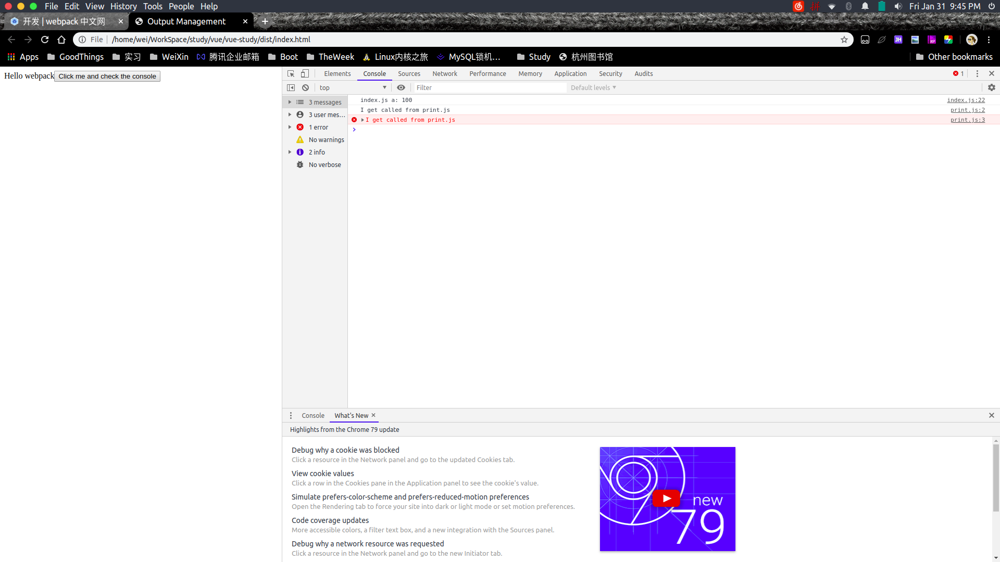

# [webpack 基础](https://www.webpackjs.com/guides/)
## 什么是webpack
+ webpack是一个现代JavaScript应用程序的静态**模块**打包器。当webpack处理应用程序时，他会递归地构建一个依赖关系图，其中包含应用程序需要的每一个模块，然后将这些模块打包成一个或多个bundle(bundle指的是编译输出文件，即打包输出的文件)
   - webpack可以看作是模块打包机，他做的事情是，分析你的项目结构，找到JavaScript模块以及其他的一些浏览器不能直接运行的拓展语言(Scss,TypeScript等)，并将其打包为合适的格式以供浏览器使用
## webpack四个核心概念
1. 入口(Entry)
2. 输出(output)
3. loader
4. 插件(plugins)
### 核心一  入口(Entry)
+ 入口起点(Entry Point)指示webpack应该使用哪个模块，来作为构建其内部依赖图的开始。进入入口起点后，webpack会找出有哪些模块和库是入口起点(直接或者间接)依赖的
   - 会解析入口文件中的所有依赖项，相当于模块间的组合
+ 每一个依赖项随即被处理，最后被输出到称之为 bundles文件中
+ 可以通过在webpack配置中配置entry属性，来指定一个入口起点(或者多个入口起点)。默认值是 "./src"
+ 配置方式
   - 单入口
   ```javascript
   // webpack.config.js
   const config = {
           // 用法：entry: string|Array<string> (即entry可以是字符串或数组且数组元素类型为string)
           entry: './path/to/my/entry/file.js'
    };
        module.exports = config;
   ```
   - 多入口
        ```javascript
        const config = {
            // 用法: entry: {[entryChunkName: string]: string|Array<string>}
            // 即entry可以是一个对象或者数组且数组元素类型为string，entryChunkName代表的是“入口代码块名称”，这个按照规范取名即可
                entry: {
                    app: './src/app.js',
                    vendors: './src/vendors.js'
                }
            };
            module.exports = config;
        ```

        + 多个文件测试
            ```javascript
                const path =  require('path')

                /**
                * 
                */
                module.exports = {
                    entry:["./src/index.js",
                        "./src/Helloindex.js"
                ],
                    output:{
                        filename:'[name].js', // 这里的name是一个占位符，js文件的名称
                        path:path.resolve(__dirname,'dist')
                    }
                }
            ```
            - index.js
                ```javascript
                import _ from 'lodash';

                    function component(){
                        var element = document.createElement('div')

                        element.innerHTML = _.join(['Hello','webpack'],' ');


                        return element;
                    }

                    document.body.appendChild(component());

                    var a = 100
                    console.log('index.js a: '+a)
                ```
            - Helloindex.js
                ```javascript
                        var path = require('path');
                        console.log("Hello"+path.delimiter)
                        var a = 200;
                        console.log("Helloindex.js a:"+a)
                ```
        + npm run build 之后，输入main.js。在main.js中
            1. 两个js文件里面的代码都会执行
            2. 会进行标量的替换.即代码 “console.log('index.js a: '+a)” 会被webpack编译为 "console.log("Helloindex.js a:200")",会直接将变量a替换为200.
            3. 两个文件中的变量不会互相影响(**即：变量作用域不会互相影响**)。就拿这两个文件来说index.js与Helloindex.js分别会打包到两个函数中去，js中，函数作用域是存在的
            ```javascript
               // index.js && Helloindex.js会被打包为main.js 

               // index.js在main.js中的体现
               function (n, t, r) {
                "use strict";
                r.r(t);
                var e, u = r(0),
                    i = r.n(u);
                document.body.appendChild(((e = document.createElement("div")).innerHTML = i.a.join(["Hello", "webpack"], " "), e));
                console.log("index.js a: 100")
            }
            //----------------------------------------------
               //Helloindex.js在main.js中的体现
                function (n, t, r) {
                    var e = r(6);
                    console.log("Hello" + e.delimiter);
                    console.log("Helloindex.js a:200")
                }
            ```
### 核心二 - 输出(output)
#### “输出”的作用
+ output属性有两个作用:
   1. 告诉webpack在哪里输出他所创建的bundles文件
   2. 如何命名这些文件
#### 使用方式
+ 在配置中指定一个output字段来配置这些处理过程
+ webpack.config.js
  ```javascript
    const path =  require('path')

    module.exports = {
        entry:["./src/index.js",
            "./src/Helloindex.js"
        ],
        output:{
            filename:'[name].js', // 生成bundles的名称
            path:path.resolve(__dirname,'dist') // 将bundles生成到哪里
        }
    }
  ```
### 核心三 - loader
#### “loader”作用
+ 让webpack能够去处理哪些非javascript文件(webpack 自身只理解javascript)。loader可以将所有类型的文件转换为webpack能够处理的有效模块。然后就可以利用webpack的打包能力，对他们进行处理。
   - 即：loader是一个转换器，将webpack所不能理解的文件转换为webpack能够理解的文件
#### 使用方式
+ webpack的配置中loader右两个目标
   1. test属性，值为一个模式，去匹配需要被use属性配置的loader处理的文件
   2. use属性，配置的是对test属性匹配上的文件进行处理的loader
  ```javascript
     const path = require('path')

        module.exports = {
            entry: ["./src/index.js",
                "./src/Helloindex.js"
            ],
            output: {
                filename: '[name].js',
                path: path.resolve(__dirname, 'dist')
            },
            module: {
                rules: [
                    // webpack会根据正则表达式，将.css结尾的全部文件，都将被提供给style-loader 和 css-loader去处理
                    {
                        test: /\.css$/,
                        use: [
                            'style-loader',
                            'css-loader'
                        ]
                    },
                    // webpack会根据正则表达式，将.png、.svg、.jpg、.gif结尾的文件全部交由file-loader去处理
                    {
                        test: /\.(png|svg|jpg|gif)$/,
                        use: ['file-loader']
                    }
                ]
            }
        }
  ```
#### 代码示例
+ 以图片加载为例子
    ```javascript
        import _ from 'lodash';
        import './style.css'
        import Icon  from './1.png'

        function component(){
            var element = document.createElement('div')

            element.innerHTML = _.join(['Hello','webpack'],' ');
            element.classList.add('hello')

            var myIcon = new Image();
            myIcon.src = Icon;
            element.appendChild(myIcon)


            return element;
        }

        document.body.appendChild(component());

        var a = 100
        console.log('index.js a: '+a)
    ```
+ 以上代码经过webpack打包后，在main.js中的体现
```javascript
    function (n, t, r) {
        "use strict";
        r.r(t);
        var e = r(0),
            i = r.n(e),
            u = (r(4), r.p + "eb969d586580637f053a0c12c566a836.png");
        document.body.appendChild(function () {
            var n = document.createElement("div");
            n.innerHTML = i.a.join(["Hello", "webpack"], " "), n.classList.add("hello");
            var t = new Image;
            return t.src = u, n.appendChild(t), n
        }());
        console.log("index.js a: 100")
    }
```
+ 总结
  - 当 import Icon from './1.png' ,该图像将被处理并添加到output目录，并且Icon变量将会包含该图像在处理后的最终url.当使用css-loader时，CSS中的 url('./1.png')会被类似的过程去处理。loader会识别这是一个本地文件，并将'./1.png'路径替换为“输出”目录中的图像的最终路径。html-loader会以相同的方式处理\
      + 即：
          1. 文件的打包
          2. 文件的引用
### 核心四 - 插件(plugins)
#### 插件存在的意义
+ 插件的目的是在于解决loader无法解决的事情
#### 插件是什么
+ wepack插件是一个具有apply属性的javascript对象，apply属性会被webpack compiler调用，并且compiler对象在整个编译的声明周期可见
    ```javascript
        const pluginName = 'ConsoleLogOnBuildWebpackPlugin';

        class ConsoleLogOnBuildWebpackPlugin {
            apply(compiler) {
                // compiler hook 的 tap 方法的第一个参数，应该是驼峰式命名的插件名称
                compiler.hooks.run.tap(pluginName, compilation => {
                    console.log("webpack 构建过程开始！");
                });
            }
        }
    ```
#### 插件的用法
+ 由于插件可以携带参数/选项，你必须在 webpack 配置中，向 plugins 属性传入 new 实例。
    ```javascript
            const path = require('path')
            /**
            * require 返回的要不要用{}括起来，需要看export时是否有名字
            */
            const HtmlWebpackPlugin = require('html-webpack-plugin');
            const { CleanWebpackPlugin }  = require('clean-webpack-plugin');

            module.exports = {
                entry: {
                    app:"./src/index.js",
                    print:"./src/print.js"
                },
                output: {
                    filename: '[name].bundle.js',
                    path: path.resolve(__dirname, 'dist')
                },
                module: {
                    rules: [{
                            test: /\.css$/,
                            use: [
                                'style-loader',
                                'css-loader'
                            ]
                        },
                        {
                            test: /\.(png|svg|jpg|gif)$/,
                            use: ['file-loader']
                        }
                    ]
                },
                plugins:[
                    new HtmlWebpackPlugin({title:"Output Management"}),
                    new CleanWebpackPlugin()
                ]
            }
    ```
## source-map
### source-map 功能
+ source-map 构建了处理前代码和处理后代码之间的桥梁，主要用于开发人员的错误定位。
    - 项目代码进行编译之后，处理后的项目代码和源代码差异性很大，会造成无法debug的问题。例如:处理后的代码出现bug，调试的时候只能定位到压缩处理后的代码的位置，无法定位到源代码的位置。source-map就是解决代码行号定位的问题(类似于class文件中的LineNumberTable属性)
    - 另一种理解方式：为了更容易地追踪错误和警告，JavaScript 提供了 source map 功能，将编译后的代码映射回原始源代码。如果一个错误来自于 b.js，source map 就会明确的告诉你
### source-map 应用
```javascript
    const path = require('path')
    /**
    * require 返回的要不要用{}括起来，需要看export时是否有名字
    */
    const HtmlWebpackPlugin = require('html-webpack-plugin');
    const { CleanWebpackPlugin }  = require('clean-webpack-plugin');

    module.exports = {
        entry: {
            app:"./src/index.js",
            print:"./src/print.js"
        },
        output: {
            filename: '[name].bundle.js',
            path: path.resolve(__dirname, 'dist')
        },
        module: {
            rules: [{
                    test: /\.css$/,
                    use: [
                        'style-loader',
                        'css-loader'
                    ]
                },
                {
                    test: /\.(png|svg|jpg|gif)$/,
                    use: ['file-loader']
                }
            ]
        },
        plugins:[
            new HtmlWebpackPlugin({title:"Output Management"}),
            new CleanWebpackPlugin()
        ],
        // webpack可以应用多种source-map,在生产环境不能使用inline-source-map
        devtool:'inline-source-map'
    }
```
  -  如图，source-map 能够精准定位到是哪一个文件哪一行出现了问题
    

## webpack开发工具
### 为什么需要webpack开发工具
+ 因为每次改动代码后，都需要手动编译代码(npm run build)，这样很麻烦
### webpack 开发工具 --- webpack-dev-server
#### webpack-dev-server
+ webpack-dev-server提供了一个简单的web服务器，并且能够实时重新加载(能够实现页面的自动刷新，在存在代码改动)
#### 使用方式
1. 安装依赖:npm install --save-dev webpack-dev-server
2. 修改配置文件(在package.json文件的scripts标签中添加start脚本，如下代码所示)
    ```json
        {
            "name": "vue-study",
            "version": "1.0.0",
            "description": "",
            "private": true,
            "scripts": {
                "test": "echo \"Error: no test specified\" && exit 1",
                "build": "webpack",
                // dev-server配置
                "start":"webpack-dev-server --open"
            },
            "keywords": [],
            "author": "",
            "license": "ISC",
            "devDependencies": {
                "clean-webpack-plugin": "^3.0.0",
                "css-loader": "^3.4.2",
                "file-loader": "^5.0.2",
                "html-webpack-plugin": "^3.2.0",
                "style-loader": "^1.1.3",
                "webpack": "^4.41.5",
                "webpack-cli": "^3.3.10",
                "webpack-dev-server": "^3.10.2"
            },
            "dependencies": {
                "lodash": "^4.17.15"
            }
        }
    ```
3. 修改配置文件webpack.config.json，告诉dev-server需要监听哪些文件
   ```javascript
    const path = require('path')
    /**
    * require 返回的要不要用{}括起来，需要看export时是否有名字
    */
    const HtmlWebpackPlugin = require('html-webpack-plugin');
    const { CleanWebpackPlugin }  = require('clean-webpack-plugin');

    module.exports = {
        entry: {
            app:"./src/index.js",
            print:"./src/print.js"
        },
        output: {
            filename: '[name].bundle.js',
            path: path.resolve(__dirname, 'dist')
        },
        module: {
            rules: [{
                    test: /\.css$/,
                    use: [
                        'style-loader',
                        'css-loader'
                    ]
                },
                {
                    test: /\.(png|svg|jpg|gif)$/,
                    use: ['file-loader']
                }
            ]
        },
        plugins:[
            new HtmlWebpackPlugin({title:"Output Management"}),
            new CleanWebpackPlugin()
        ],
        devtool:'inline-source-map',
        //dev-server配置，表示监听哪些文件
        devServer:{
            contentBase:"./dist"
        }
    }
   ```
4. 命令行中运行 npm start，就会看到浏览器自动加载页面。如果现在修改和保存任意源文件，web 服务器就会自动重新加载编译后的代码
5. [更多dev-server配置](https://www.webpackjs.com/configuration/dev-server/)
## Tree Sharking
### 什么是Tree Sharking
+ 移除JavaScript上下文中未引用代码(dead-code),依赖于ES2015模块系统中的静态结构特性(只使用与ES5的module，即import...export)。如:import , export
#### 代码解释：什么是Tree Sharking 
1. 存在工具类文件math.js(**纯ES2015语法的代码**)
```javascript
    // 求x平方 
    export function square(x) {
        return x * x;
    }
    // 求x立方
    export function cube(x) {
        return x * x * x;
    }
```
2. index.js文件(**引用了math.js里面的工具方法,但是仅仅引用了cube方法**)
```javascript
    import printMe from "./print.js"
    import {cube} from './math.js';

    function component(){
        var element = document.createElement('pre')

        element.innerHTML = [
            "Hello Webpack",
            "5 cubed is equal to "+ cube(5)
        ].join('\n\n')
        return element;
    }

    document.body.appendChild(component());
```
3. 编译后的index.js文件，我们没有使用square方法，webpack也将他们导入进来了，且在这里还没有使用tree sharking
```javascript
            /***/ "./src/math.js":
        /*!*********************!*\
        !*** ./src/math.js ***!
        \*********************/
        /*! exports provided: square, cube <注意这里>*/
        /***/ (function(module, __webpack_exports__, __webpack_require__) {

        "use strict";
        __webpack_require__.r(__webpack_exports__);
        /* harmony export (binding) */ __webpack_require__.d(__webpack_exports__, "square", function() { return square; });
        /* harmony export (binding) */ __webpack_require__.d(__webpack_exports__, "cube", function() { return cube; });
        function square(x) {
            return x * x;
        }

        function cube(x) {
            return x * x * x;
        }

        /***/ })
```
4. 使用 Tree Sharking
   1. 新增一步 
        - 因为是环境是development(即在webpack.config.js中配置了mode:"development")不是自带tree sharking,需要在webpack.config.js配置
        - 在webpack.config.js配置optimization
        ```javascript
            const path = require('path')
            /**
            * require 返回的要不要用{}括起来，需要看export时是否有名字
            */
            const HtmlWebpackPlugin = require('html-webpack-plugin');
            const { CleanWebpackPlugin }  = require('clean-webpack-plugin');
            const UglifyJs = require('uglifyjs-webpack-plugin');
            const UglifyJs = require('uglifyjs-webpack-plugin');

            module.exports = {
                // 学习使用开发环境，这样生成的bundles文件会有注释
                mode:"development",
                entry: {
                    app:"./src/index.js"
                },
                output: {
                    filename: '[name].bundle.js',
                    path: path.resolve(__dirname, 'dist')
                },
                module: {
                    rules: [{
                            test: /\.css$/,
                            use: [
                                'style-loader',
                                'css-loader'
                            ]
                        },
                        {
                            test: /\.(png|svg|jpg|gif)$/,
                            use: ['file-loader']
                        }
                    ]
                },
                plugins:[
                    new HtmlWebpackPlugin({title:"Output Management"}),
                    new CleanWebpackPlugin(),
                    // 代码压缩
                     new UglifyJs()
                ],
                devtool:'inline-source-map',
                devServer:{
                    contentBase:"./dist"
                },
                optimization:{
                    // 对使用的模块进行打包
                    usedExports:true
                }
            }
        ```
   2. 配置Tree Sharking步骤1：在package.json添加配置02
        ```json
        // 01这表示index.js确实存在副作用，这是部分文件存在副作用的用法
            "sideEffects": [
                "./src/index.js"
            ] 

        // 02这表示所有的代码都不包含副作用，相当于告知webpack，它可以安全移除未用到的export导出
            "sideEffects": false
        ```
+ 精简之后的index.js编译后的代码
    ```javascript
            /***/ "./src/math.js":
        /*!*********************!*\
        !*** ./src/math.js ***!
        \*********************/
        /*! exports provided: square, cube */
        /*! exports used: cube  */
        /***/ (function(module, __webpack_exports__, __webpack_require__) {

        "use strict";
        /* unused harmony export square */
        /* harmony export (binding) */ __webpack_require__.d(__webpack_exports__, "a", function() { return cube; });
        function square(x) {
            return x * x;
        }

        function cube(x) {
            return x * x * x;
        }

        /***/ })

        /**
        /*! exports used: cube  */ // 出现这一行表示tree sharking已经生效，表示该模块提供的方法中我只使用了cube方法,即：打包工具已经知晓了该模块提供了两个方法，但是仅仅使用了cube方法
         
        // 在development模式下，及时tree sharking生效了，打包工具也不会删除这部分没有使用的代码，只会在代码中提示。为了调试，若删除了，会导致source-map对应的行数错误

        // 只需要将webpack.config.js 中的mode改为production时，就会执行代码删除的动作了。在production模式下，js配置optimization不用配置，仅仅需要配置sideEffects
        */
    ```
## 生产环境构建
### 为什么需要生产环境构建 
  + 开发环境(development) 和 生产环境(production)的构建目标差异很大。
     - 在开发环境中，我们需要强大的、具有实时重加载或热替换能力的source-map和localhost server。
     - 在生产环境中，我们的目标是转向于更小的bundle，更轻量的source-map，以及更优化的资源以改善加载时间
  + 是故，我们需要对于每一个环境编写彼此独立的webpack配置
### 如何编写独立的webpack配置
#### 工具:webpack-merge
+ 基于不重复原则，保留一个通用的配置。再使用工具webpack-merge将特有的配置合并到一起
+ 安装: npm install --save-dev webpack-merge
### 代码示例
#### webpack.common.js(提取出来的公共配置)
```javascript
    const path = require('path')
    /**
    * require 返回的要不要用{}括起来，需要看export时是否有名字
    */
    const HtmlWebpackPlugin = require('html-webpack-plugin');
    const {
        CleanWebpackPlugin
    } = require('clean-webpack-plugin');

    module.exports = {
        entry: {
            app: "./src/index.js"
        },
        output: {
            filename: '[name].bundle.js',
            path: path.resolve(__dirname, 'dist')
        },
        plugins: [
            new HtmlWebpackPlugin({
                title: "Output Management"
            }),
            new CleanWebpackPlugin(),
        ]
    }
```
#### webpack.dev.js(测试环境配置)
```javascript
const webpackMerge = require('webpack-merge')
const common = require('./webpack.common.js')

module.exports = webpackMerge(common,{
    mode:"development",
    devtool:"inline-source-map",
    devServer:{
        contentBase:"./dist"
    }
});
```
#### webpack.prod.js(正式环境配置)
```javascript
const webpackMerge = require('webpack-merge')
const common = require('./webpack.common.js')
const UglifuJsPlugin = require('uglifyjs-webpack-plugin')
const webpack = require('webpack')

module.exports = webpackMerge(common, {
    mode:"production",
    plugins: [
        new UglifuJsPlugin({
            sourceMap: true
        }),
        new webpack.DefinePlugin({
            'process.env.NODE_ENV':JSON.stringify('development')
        })
    ]
});
```
+ 这里需要注意的配置是**'process.env.NODE_ENV':JSON.stringify('development')** 
  - 许多 library 将通过与 process.env.NODE_ENV 环境变量关联，以决定 library 中应该引用哪些内容。例如，当不处于生产环境中时，某些 library 为了使调试变得容易，可能会添加额外的日志记录(log)和测试(test)
#### 使用方式
+ 因为在webpack.dev.js 以及 webpack.prod.js 配置文件中使用了webpack-merge工具将配置合并(基础配置&&对应环境的配置)，故在这里直接根据环境使用相对应的配置文件即可(测试环境-webpack.dev.js , 生产环境-webpack.prod.js).如 npm run build(由package.json文件(scripts标签得知)可知，这是生产环境打包) 、npm run dev-build(由package.json文件(scripts标签得知)可知，这是测试环境打包)
## 代码分离
### 为什么要代码分离
+  将代码分离到不同的bundle上，然后可以按需加载或并行加载这些文件。
+ 代码分离可以用于获取更小的bundle，以及控制资源加载优先级。若使用合理，会极大影响加载时间。
### 代码分离的方式
1. 入口起点，使用entry配置手动的分离代码
2. 防止重复，使用CommonsChunkPlugin去重和分离chunk。 即:**静态导入**
3. 动态导入
#### 1.代码分离之入口起点
##### 什么是入口起点方式
+ 即：在编写代码的时候就将代码分离开。例如：业务代码就是业务代码，工具代码就是工具代码
##### 代码实例
+ 文件1.index.js
+ 文件2.another-module.js
+ 文件3.webpack.config.js
```javascript
// 代码省略
    module.exports = {
        //.....
        entry:{
            index:"./src/index.js",
            another:"./src/another-module.js"
        }
    }
// 代码省略
```
+ 例如这样的，将代码分为index.js和another-module.js两个代码文件
##### 入口起点存在的问题
1. 若入口chunks之间包含重复的模块，那这些重复模块都会被引入到各个bundle中
2. 不够灵活，不能将核心应用程序逻辑进行动态拆分代码
   - 例如：在index.js和another-module.js中均引入lodash，这就会在两个bundle中造成重复引用。
#### 2. 防止重复(将公共的地方提取出来)
##### 静态导入和动态导入
###### 静态导入
 ```javascript
   import _ from 'lodash' // 静态导入方式
 ```
###### 动态导入
```javascript
    function getComponent() {
        return import( /* webpackChunkName: "lodash1" */ 'lodash').then(({default: _}) => {
            var element = document.createElement('div');
            element.innerHTML = _.join(['Hello', 'webpack'], " ")
            console.log(_.join(['Hello', 'webpack',add(1,2)], " "))
            return element;
        })
    }

    getComponent().then(component => {
        document.body.appendChild(component)
    })
```
+ 其中注释中的lodash1表示这个chunk的name
+ 要使用到这个name，还需要在output下配置chunkFilename:
```javascript
    output: {
            filename: '[name].bundle.js',
            path: path.resolve(__dirname, 'dist'),
            chunkFilename:"[name].bundle.js"
    }
```
###### 动态导入&&静态导入的区别
+ 实现代码分割的方式有两种
    1. 同步代码导入：需要在webpack.config.js中做optimization的配置
    2. 异步代码导入:无需配置，自动进行代码的分割
+ 动态导入&&静态导入不可以同时使用{或者说可以同时使用，代码也可以分离出来，但实际可能会造成cacheGroups的缓存失效-即：明明可以抽取到一个文件里的，但是每一个chunk都形成了一个新的文件。例如entry a,b都引入math.js，但实际打包后会形成...~a.bundle.js 和...~b.bundle.js ，而这两个bundle的内容一致}
##### 什么是防止重复
+ CommonsChunkPlugin插件(在webpack4.o中已失效，被SplitChunksPlugin代替)可以将公共的依赖模块提取到已有的入口chunk中，或者提取到一个新生成的chunk中
##### [SplitChunksPlugin 配置讲解(适用于静态导入)](https://webpack.js.org/plugins/split-chunks-plugin/)
+ webpack.config.js
```javascript
    optimization: {
        splitChunks: {
            chunks: "all",
            minSize: 100,
            minChunks: 1,
            maxAsyncRequests: 5,
            maxInitialRequests: 3,
            automaticNameDelimiter: '~',
            name: true,
            cacheGroups: {
                vendors: {
                    test: /[\\/]node_modules[\\/]/,
                    priority: 10,
                    filename: 'vender.js'
                },
                wang: {
                    name: true,
                    test: /[\\/]src[\\/]/,
                    minSize: 10,
                    chunks: "all",
                    priority: 5,
                    filename: "common-wang.js"
                },
                wei: {
                    name(module, chunks, cacheGroupKey) {
                        const moduleFileName = module.identifier().split('/').reduceRight(item => item);
                        const allChunksNames = chunks.map((item) => item.name).join('~');
                        return `${cacheGroupKey}-${allChunksNames}-${moduleFileName}`;
                    },
                    test: /[\\/]src[\\/]util[\\/]/,
                    minSize: 10,
                    chunks: "all",
                    priority: 6,
                    filename: "common-wei.js"
                },
                default: {
                    minChunks: 2,
                    priority: 1,
                    reuseExistingChunk: true
                }
            }
        }
    }
```
+ chunks
   - 值可以为initial(静态加载)、async(动态加载)、all(所有)
+ minSize:
   - 当文件超过这个多个字节的时候就进行代码分割
+ mixChunks
   - 表示该库被引用了几次才进行代码分割
+ maxAsyncRequests
   - 同时加载的模块数，即webpack分隔代码时形成了5个新文件之后就不会再进行代码的分割了
+ maxInitialRequests
   - 入口文件进行代码分割，也只会生成三个.js文件，之后就不会在分割了
+ automaticNameDelimiter
  - 文件名称连接符
+ name
  - boolean = true function (module, chunks, cacheGroupKey) => string string
    1. 该规则同样适用于每一个cacheGroup的splitChunks.cacheGroup.{cacheGroup}.name。
    2. 如果设置为true，它将基于chunk和cache group key自动生成一个名字。
    3. 如果设置为一个字符串或者一个函数的话，它将允许你生成一个自定义的名字。尤其是如果你设置的是同一个字符串或者一个函数总是返回相同的字符串，它将自动把所有的通用模块和vendor都合并到一个chunk里面去。这将导致一个比较大的初始化下载，并且加载页面数据会比较慢
+ cacheGroups(缓存组)，针对与同步代码打包有效
  - 一个缓存，例如：存在多个文件a，b,c，他们处理的先后顺序不一样，但是都满足vendors这个cacheGroup，那么webpack会将a,b,c三个chunk缓存起来，待webpack分析完整个项目之后，会将a,b,c都分隔到vender.js文件中
  - 里面的缓存cacheGroup可以自定义
  - cacheGroup中的test是一个正在表达式，匹配被引入的库
  - cacheGroup中的priority表示优先级，数值越大，优先级越高。
      + 这里的优先级是什么意思呢？即存在一个库a，他同时满足vendors和default这两个cacheGroup，但是他会被代码分隔到哪一个文件中去呢?答案是根据priority来决定。哪个优先级高就打包到哪一个文件中去
## 缓存
### 为什么需要缓存
+ 浏览器会使用缓存技术，可以通过命中缓存，以降低网络流量，使得网站加载速度更快。然而，如果我们在部署新版本的时候不更改资源的文件名称，浏览器很可能会认为他没有被更新，就会使用他的缓存版本。由于缓存的存在，当你需要获取新的代码的时候，就很棘手
### 输出文件的文件名
+ 通过使用output.filename进行文件名称的替换，可以确保浏览器获取修改后的文件。可以在文件名中包含一个chunk相关的哈希([chunkhash])
   - 这里的chunkhash是文件内容的哈希，若文件没有更改，及时我们重复构建，文件名会保持不变。但是若存在样板(runtime或manifest)，即时文件没有更改，文件名也可能改变
+ 配置
```javascript
 output: {
        filename: '[name].[chunkhash].js', // chunkhash
        path: path.resolve(__dirname, 'dist'),
        chunkFilename:"[name].[chunkhash].js"
    },
```
### 提取模块
+ 将第三方的库抽取到单独的vendor chunk文件中，因为第三方库很少像本地代码那样修改
## 注意
### 01.npm run 表示执行脚本，参数是在package.json中的script标签配置的内容，可以自定义
+ script 是自定义命令的集合，将命令交由npm去运行
```json
        {
            "name": "vue-study",
            "sideEffects": false,
            "version": "1.0.0",
            "description": "",
            "private": true,
            "scripts": {
                "test": "echo \"Error: no test specified\" && exit 1",
                "build": "webpack --config webpack.prod.js",
                "dev-build": "webpack --config webpack.dev.js",
                "start": "webpack-dev-server --open --config webpack.dev.js"
            },
            "keywords": [],
            "author": "",
            "license": "ISC",
            "devDependencies": {
                "clean-webpack-plugin": "^3.0.0",
                "css-loader": "^3.4.2",
                "file-loader": "^5.0.2",
                "html-webpack-plugin": "^3.2.0",
                "style-loader": "^1.1.3",
                "uglify-js": "^3.7.6",
                "uglifyjs-webpack-plugin": "^2.2.0",
                "webpack": "^4.41.5",
                "webpack-cli": "^3.3.10",
                "webpack-dev-server": "^3.10.2",
                "webpack-merge": "^4.2.2"
            },
            "dependencies": {
                "lodash": "^4.17.15"
            }
        }
```
+ 如：npm run build 、 npm run test、npm run start、npm run dev-build
###  02. webpack.config.js
#### 注意
1. mode设置为"development",更有利于学习。
    + webpack编译后生成的bundles文件会有注释
#### webpack.config.js配置文件内容
    ```javascript
            const path = require('path')
            /**
            * require 返回的要不要用{}括起来，需要看export时是否有名字
            */
            const HtmlWebpackPlugin = require('html-webpack-plugin');
            const { CleanWebpackPlugin }  = require('clean-webpack-plugin');
            const UglifyJs = require('uglifyjs-webpack-plugin');

            module.exports = {
                // 学习使用开发环境，这样生成的bundles文件会有注释
                mode:"development",
                entry: {
                    app:"./src/index.js"
                },
                output: {
                    filename: '[name].bundle.js',
                    path: path.resolve(__dirname, 'dist')
                },
                module: {
                    rules: [{
                            test: /\.css$/,
                            use: [
                                'style-loader',
                                'css-loader'
                            ]
                        },
                        {
                            test: /\.(png|svg|jpg|gif)$/,
                            use: ['file-loader']
                        }
                    ]
                },
                plugins:[
                    new HtmlWebpackPlugin({title:"Output Management"}),
                    new CleanWebpackPlugin()
                ],
                devtool:'inline-source-map',
                devServer:{
                    contentBase:"./dist"
                }
            }
    ```