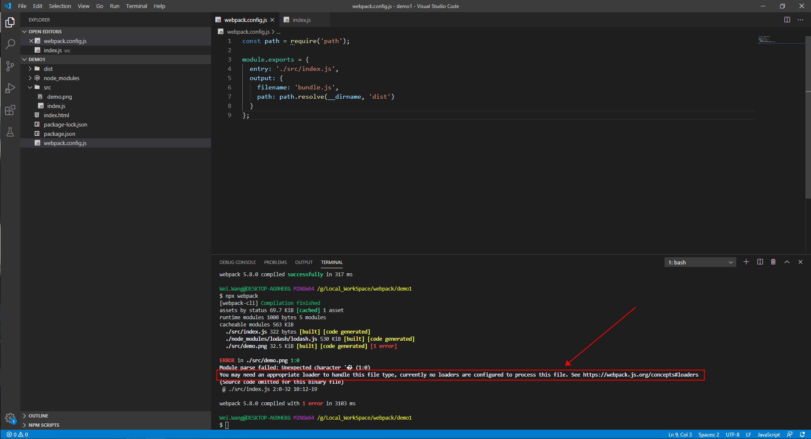

# Webpack核心概念之Loader
## 什么是loader
+ Loader是提供给webpack对其他资源(除JavaScript之外的)进行打包的一个打包方案 
## 运行在什么时候
+ 
## 示例
### 01.使用file-loader对图片进行打包
+ index.js
    ```js
    import _ from 'lodash';
    import demopng from './demo.png' // 这里使用了图片静态资源

    function component() {
    var element = document.createElement('div');

    element.innerHTML = _.join(['Hello', 'webpack'], ' ');

    var img = new Image();
    img.src = demopng
    element.appendChild(img);

    return element;
    }
    document.body.appendChild(component());
    ```
+ webpack.config.js
    ```js
    // 目前还没有配置loader
    const path = require('path');

    module.exports = {
    entry: './src/index.js',
    output: {
        filename: 'bundle.js',
        path: path.resolve(__dirname, 'dist')
    }
    };
    ```
+ 执行npx webpack命令，则会报错，如下
   - 
   - 如上图片，显示需要一个loader去处理这种文件类型。
+ 修改webpack.config.js文件，添加上file-loader
    ```js
        const path = require('path');

        module.exports = {
        entry: './src/index.js',
        module: { // 以下的规则是在module(模块)下进行配置的
            rules: [ // 规则配置
            {
            test: /\.(png|svg|jpg|gif)$/, // 对这些资源使用file-loader类型的loader,类型是正则表达式
            use: ['file-loader'] // 对于满足test类型的资源，使用这些loader
            }
        ]
        },
        output: {
            filename: 'bundle.js',
            path: path.resolve(__dirname, 'dist')
        }
        };
    ```
  -    
  - 如上图，在webpack.conf.js(webpack默认使用的配置文件)添加上file-loader之后，打包就正常了。可以看到，图片已经打包到dist目录下了。注意，loader是在module模块下进行配置的，这也就符合了webpack是一个模块打包工具。目前是在给模块提供打包方案.
