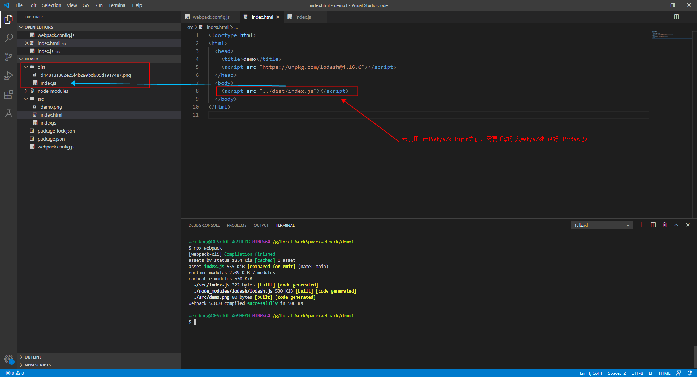
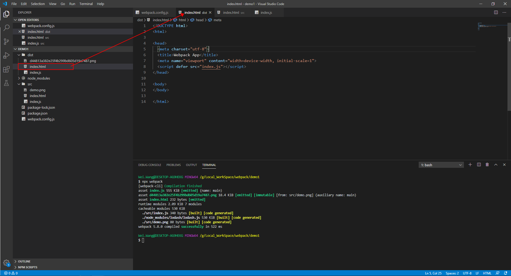
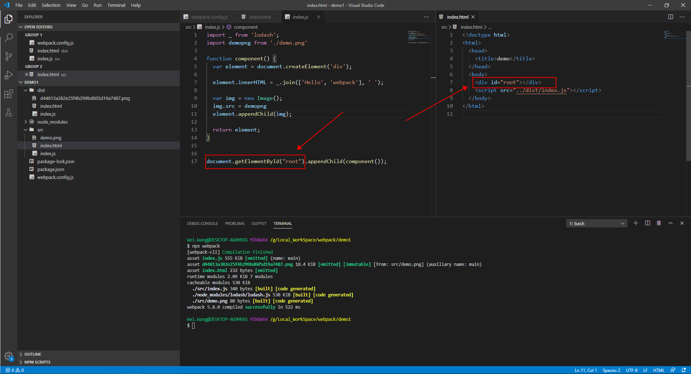
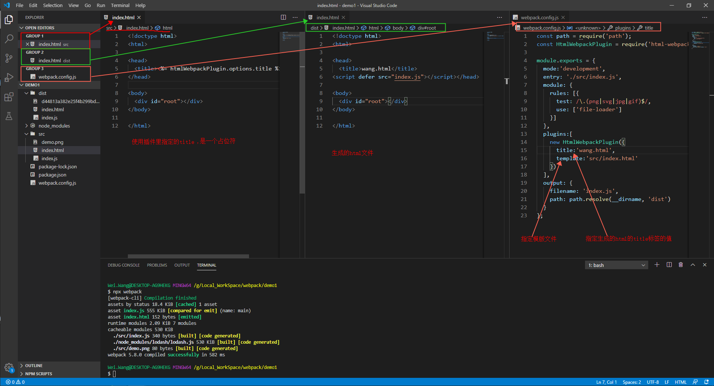
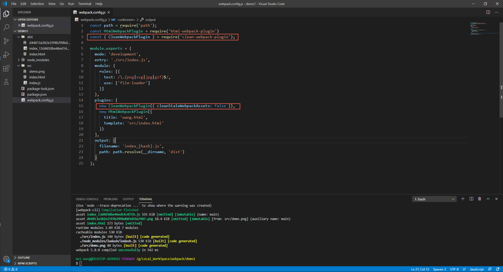

# Webpack核心概念之plugin
## 功能
+ Webpack的plugin能在webpack运行到某个时刻的时候，帮你做一些事情.
+ 多看看文档，多看看文档
## 示例
### 01.HtmlWebpackPlugin 
#### 功能
&nbsp;&nbsp;HtmlWebpackPlugin会在打包结束之后，自动生成一个html文件(可以通过配置,从而使用某一个模版来生成html文件),并把打包生成的js自动引入到这个html文件中.
+ [点击进入配置手册](https://github.com/jantimon/html-webpack-plugin#configuration)
+ 如下图，未使用HtmlWebpackPlugin之前，需要在html文件中手动引入打包好的js文件。
   - 
   - 如上图，每次构建完成之后都需要来修改html文件，太麻烦了，因此使用HtmlWebpackPlugin插件来解决这个问题。
+ 使用HtmlWebpackPlugin插件
    ```js
    const path = require('path');
    const HtmlWebpackPlugin = require('html-webpack-plugin') // 引入插件，CommonJS语法，对应的导出是:module.exports=.....

    module.exports = {
    mode:'development',
    entry: './src/index.js',
    module: {
        rules: [{
        test: /\.(png|svg|jpg|gif)$/,
        use: ['file-loader']
        }]
    },
    plugins:[ 
        new HtmlWebpackPlugin() // new出一个实例
    ],
    output: {
        filename: 'index.js',
        path: path.resolve(__dirname, 'dist')
    }
    };
    ```
   -  
   - 将上图与之前的图对比，发现在dist目录下生成了一个新的html文件  
+ 但是，如下图,与上述生成的html文件进行对比，发现上述生成的html文件是没有id="root"的div标签的，因此，执行时肯定是报错的。那么怎么办呢？
  -   
+ 因为上述问题(缺少id="root"的div标签)，解决方案: HtmlWebpackPlugin是允许指定模版html文件的，使用具体的配置即可:
  - 
  - [关于更多HtmlWebpackPlugin的配置请点击](https://github.com/jantimon/html-webpack-plugin#configuration)
+ 到目前为止，使用了Html模块来提供给HtmlWebpackPlugin插件来生成html文件，避免程序报错。也利用了HtmlWebpackPlugin插件来自动生成Html文件，避免了手工修改引用js的工作。
+ 最后，是不是了解了Vue，Taro等脚手架多页面的原理了  
--------------------
### 02.CleanWebpackPlugin
&nbsp;&nbsp;在打包开始之前，我们希望能够清理掉上次打包出来的文件(即dist目录以及其下的文件)，基于这样的业务场景，我们可以使用CleanWebpackPlugin插件来完成。
+ 如下，具体的使用方式如同HtmlWebpackPlugin,只是配置方式不一致
   - 
   - [更多CleanWebpackPlugin的配置请点击](https://github.com/johnagan/clean-webpack-plugin)
