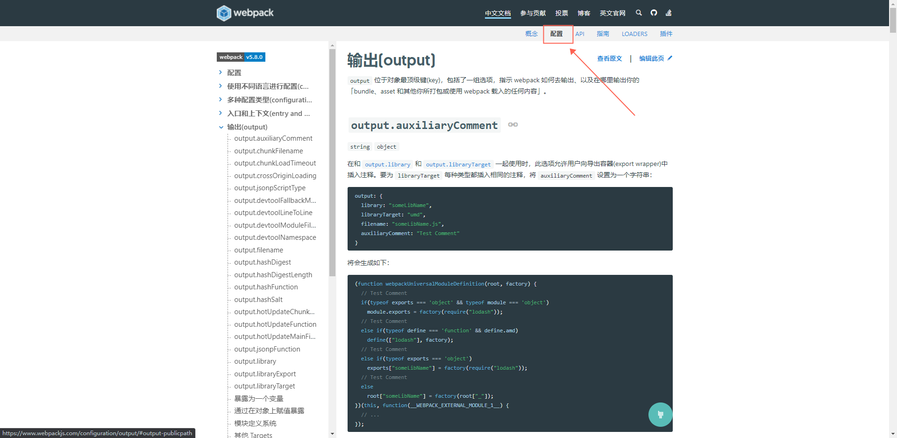
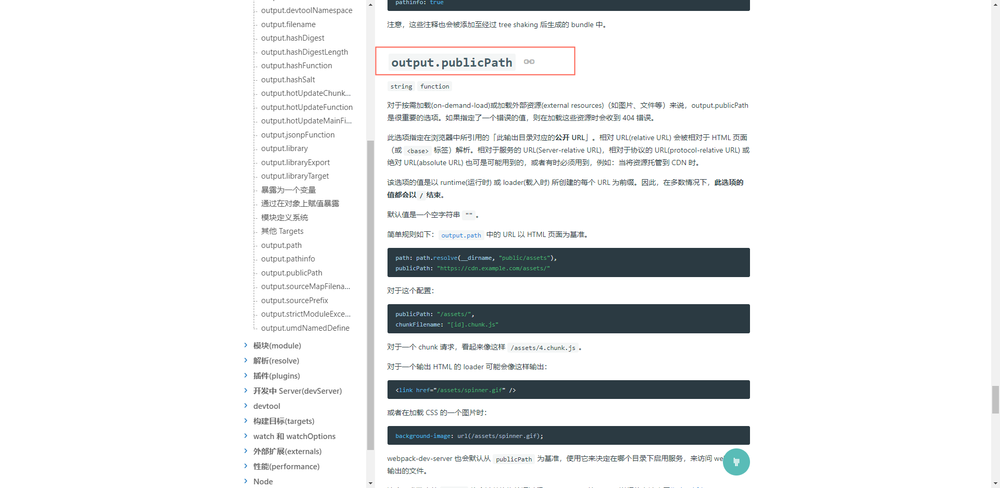

# Webpack核心概念之Entry&&Output
+ [想要了解更多,请详见官方文档的配置部分,更多详细的配置尽在其中](https://www.webpackjs.com/configuration/)
  - 
## 01.Entry
## 02.Output
+ publicPath: **想一想webview是如何部署的,本地构件时是如何配置的**
   - 例如: publicPath:'/' 表示打包生成的文件的引用前面都添加一个/路径，防止文件引用时路径错误
   - 