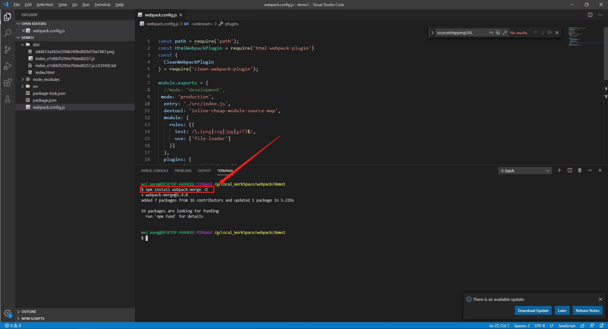

# webpack之webpack-merge插件
## 背景
+ [点击查看文档](https://github.com/survivejs/webpack-merge)(https://github.com/survivejs/webpack-merge)
+ 代码开发分为开发环境和正式环境，开发环境和正式环境的配置大部分是相同的，仅存在与部分配置不同。那么就需要将相同的配置抽取出来，当基础配置修改的时候，只需要修改一处。
## 功能
1. 当webpack的配置分散在多个js文件中时,在运行时对webpack的配置文件进行合并,将合并后的配置文件作为webpack运行的配置文件.
## 使用示例
### step1.现有如下webpack配置文件
+ webpack.config.js
    ```js
    const path = require('path');
    const HtmlWebpackPlugin = require('html-webpack-plugin')
    const {
    CleanWebpackPlugin
    } = require('clean-webpack-plugin');

    module.exports = {
      entry: './src/index.js',
      devtool: 'inline-cheap-module-source-map',
      module: {
          rules: [{
            test: /\.(png|svg|jpg|gif)$/,
            use: ['file-loader']
          }]
      },
      plugins: [
          new CleanWebpackPlugin({
            cleanStaleWebpackAssets: false
          }),
          new HtmlWebpackPlugin({
            title: 'wang.html',
            template: 'src/index.html'
          })
      ],
      output: {
          filename: 'index_[hash].js',
          path: path.resolve(__dirname, 'dist')
      }
    };
    ```
### step2. 安装webpack-merge插件  
   +   
### step2.将webpack.config.js拆解
+ 将webpack.config.js拆解为
    1. webpack.common.js 公共配置
    2. webpack.dev.js 开发环境配置
    3. webpack.prod.js   正式环境配置
+ **公共基础配置文件: webpack.common.js**
   ```js
        const path = require('path');
        const HtmlWebpackPlugin = require('html-webpack-plugin')
        const {
            CleanWebpackPlugin
        } = require('clean-webpack-plugin');

        module.exports = {
            entry: './src/index.js',
            devtool: 'inline-cheap-module-source-map',
            module: {
                rules: [{
                    test: /\.(png|svg|jpg|gif)$/,
                    use: ['file-loader']
                }]
            },
            plugins: [
                new CleanWebpackPlugin({
                    cleanStaleWebpackAssets: false
                }),
                new HtmlWebpackPlugin({
                    title: 'wang.html',
                    template: 'src/index.html'
                })
            ],
            output: {
                filename: 'index_[hash].js',
                path: path.resolve(__dirname, 'dist')
            }
        };
   ```    
+ **开发环境配置文件:webpack.dev.js**   
    ```js
        // 引入公共基础配置
        const webpackCommonConfig = require('./webpack.common.js');
        // 引入webpack-merge依赖
        const { merge } = require('webpack-merge');


        // 配置测试环境配置
        const devConfig =  {
          mode: 'development'
        };

        // 将公共基础配置和测试环境配置合并，形成总的配置文件,并导出
        module.exports = merge(webpackCommonConfig,devConfig)
    ```
+ **正式环境配置文件:webpack.prod.js** 
   ```js
    // 引入公共基础配置
    const webpackCommonConfig = require('./webpack.common.js');
    // 引入webpack-merge依赖
    const { merge } = require('webpack-merge');


    // 配置正式环境配置
    const prodConfig =  {
      mode: 'production'
    };

    // 将公共基础配置和正式环境配置合并，形成总的配置文件,并导出
    module.exports = merge(webpackCommonConfig,prodConfig)
   ```   
### step4.修改package.json,添加npm脚本,目的是执行不同的脚本，选择不同的环境，生成对应环境的代码
+ package.json
   ```json
      {
        "name": "demo1",
        "version": "1.0.0",
        "description": "",
        "private": true,
        "scripts": {
            "dev": "webpack --config webpack.dev.js", // 开发环境执行脚本
            "build": "webpack --config webpack.prod.js" // 正式环境执行脚本
        },
        "keywords": [],
        "author": "",
        "license": "ISC",
        "dependencies": {
            "lodash": "^4.17.20",
            "webpack": "^5.8.0"
        },
        "devDependencies": {
            "clean-webpack-plugin": "^3.0.0",
            "file-loader": "^6.2.0",
            "html-webpack-plugin": "^5.0.0-alpha.14",
            "webpack-cli": "^4.2.0",
            "webpack-merge": "^5.4.0" // 安装的webpack-merge依赖
        }
       }
   ```   