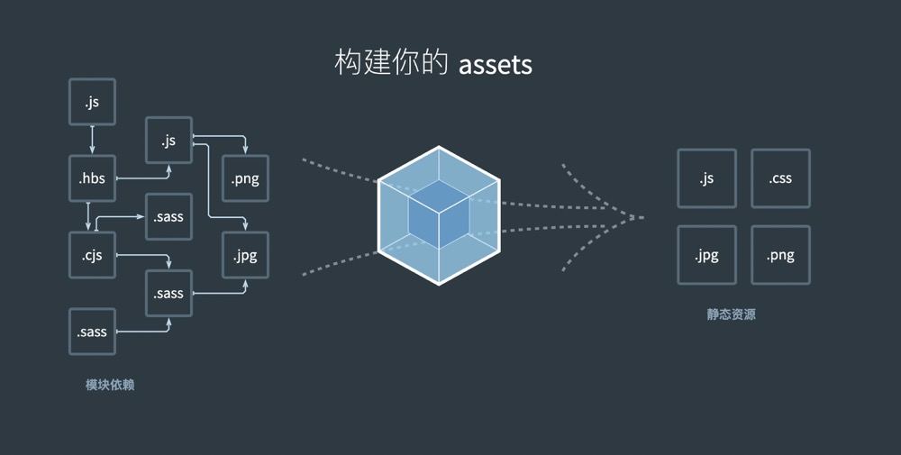
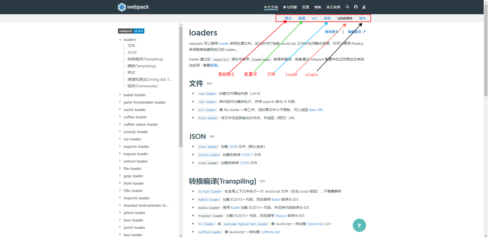

# Webpack - 前端构建工具
&nbsp;&nbsp;webpack 是一个用于现代 JavaScript 应用程序的 静态模块打包工具。当 webpack 处理应用程序时，它会在内部从一个或多个入口点构建一个 依赖图(dependency graph)，然后将你项目中所需的每一个模块组合成一个或多个 bundles，它们均为静态资源，用于展示你的内容。

&nbsp;&nbsp;如下图，webpack是将其他资源转换为.js,.css,.png等浏览器识别的静态资源,即： 没有利用到浏览器支持模块化的能力。
- 

## 参考资料
1. [webpack 官方文档](https://webpack.js.org/guides/getting-started/)
2. 文档阅读:
   + 