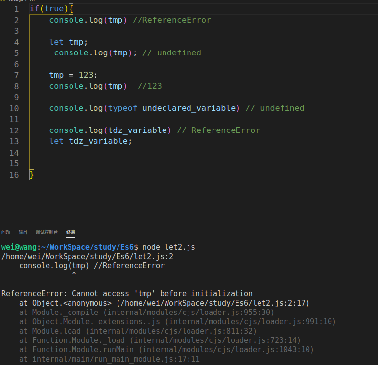

# let & const 命令
## 01. let 命令
+ 功能： 用于声明变量，用法类似与var，但是let所声明的变量只在let命令所在的代码块内有效。
   - 即：let命令声明的变量拥有**块级作用域**，注意，let声明的变量有块级作用域了
   - 代码展示：
        ```javascript
            {
                var a = 'Hello World';
                let b = 123;
            }
            console.log(a); // 输出Hello World
            console.log(b); // b is not defined
        ```
   - 结果输出： 
   - 
### 在for循环中使用let是比较适合的
+ 代码演示:
    ```js
        // for循环搭配var使用
        for (var indexVar = 0; indexVar < 9; indexVar++) {
            console.log('var for循环:' + indexVar)
        }

        // 打印indexVar变量的值
        console.log('indexVar:' + indexVar)


        // for循环搭配let使用
        for (let indexLet = 0; indexLet < 9; indexLet++) {
            console.log('let for循环:' + indexLet)
        }
        // 打印indexLet变量的值
        console.log('indexLet : ' + indexLet)

        // 输出:
        /*
        wei@wang:~/WorkSpace/study/Es6$ node let.js 
        var for循环:0
        var for循环:1
        var for循环:2
        var for循环:3
        var for循环:4
        var for循环:5
        var for循环:6
        var for循环:7
        var for循环:8
        indexVar:9
        let for循环:0
        let for循环:1
        let for循环:2
        let for循环:3
        let for循环:4
        let for循环:5
        let for循环:6
        let for循环:7
        let for循环:8
        /home/wei/WorkSpace/study/Es6/let.js:15
        console.log('indexLet : ' + indexLet)
                                    ^

        ReferenceError: indexLet is not defined
            at Object.<anonymous> (/home/wei/WorkSpace/study/Es6/let.js:15:29)
            at Module._compile (internal/modules/cjs/loader.js:955:30)
            at Object.Module._extensions..js (internal/modules/cjs/loader.js:991:10)
            at Module.load (internal/modules/cjs/loader.js:811:32)
            at Function.Module._load (internal/modules/cjs/loader.js:723:14)
            at Function.Module.runMain (internal/modules/cjs/loader.js:1043:10)
            at internal/main/run_main_module.js:17:11 */
    ```
    + 即，let声明的变量是有块级作用域的，当到了for循环的作用域之外，let声明的变量就失效了。
### 如何理解index和index2的值
#### 代码一，var配合for使用，a[6]()会输出什么?
    ```javascript
        var a = [];
        for (var index = 0; index < 10; index++) {
            a[index] = function () {
                console.log(index);
            };
        }

        a[6]() // 输出10
        console.log(a[6].toString())/* 输出
        function () {
            console.log(index);
        }
        */
    ```
+ 为什么a\[6\]()会输出10？
  - 因为index是由var声明的，在全局范围内都有效，所以全局只有一个变量index。每一次循环，变量index的值都会发生改变，而在循环内部，被赋值给数组a的函数内的console.log(index)中的index是指向全局的index。即数组a中所有成员中的index都是同一个index，导致运行时输出的是最后一轮index的值，也就是10
#### 代码二，let配合for使用，b[6]()会输出什么？
```javascript
    var b = [];
    for (let index2 = 0; index2 < 10; index2++) {
        b[index2] = function () {
            console.log(index2)
        };
    }

    b[6]() // 6
    b[5]() // 5
    console.log(b[6].toString()) /*
        function () {
            console.log(index2)
        }
    */
```
+ 为什么b\[6\]()会输出6？
  - 变量index2是由let声明的，当前的index2仅在本循环内有效，所以每一次循环的index2都是一个新的变量，于是最后输出的是6.因为每一次循环中的index2都是重新声明的，那么js如何知道上一次循环的值且计算出本循环的值呢？这依赖于JavaScript引擎，JS引擎会记住上一次循环的值，初始化本轮的变量index2时，就在上一轮循环的基础上进行计算。
     - 即：a数组中每一个元素中的console.log(index2)中的index2都是不同的，是每一次循环新声明的变量，故执行每一个函数(数组a的每一个成员)所输出的值是不一样的
### for循环中的父子作用域
+ 如下代码
```javascript
   for(let index = 0;index <3;index++){
    let index = 'abc';
    console.log(index)
   }
 // 输出结果1: 输出三次 'abc'
 //------------------------------------------
    for(let index1 = 0;index1 <3;index1++){
        console.log(index1)
    }
    // 输出结果2: 输出 0 1 2 

  //-------------------
    function print(num) {
        console.log(num);
        return true;
    }
    for (let index1 = 0; index1 < 3 && print(i); index1++) {
        let i = 0;
        console.log(index1);
    }
    /* 输出结果3：/home/wei/WorkSpace/study/Es6/let2.js:14
   for (let index1 = 0; index1 < 3 && print(i); index1++) {
                                         ^
    ReferenceError: i is not defined
        at Object.<anonymous> (/home/wei/WorkSpace/study/Es6/let2.js:14:42) */
```
   - 由输出结果1可以得知，console.log(index)中的变量index与for循环中的循环变量index不在同一个作用域不，而是有各自单独的作用域
   - 由输出结果2得知，在for循环中，子作用域可以访问父作用域中的变量
   - 由输出结果三得知，for循环中，父作用域不能访问子作用域内的变量
### 不存在变量提升
####  var命令会发生变量提升的现象
+ var命令会发生变量提升的现象，即变量可以在声明之前使用，值为undefined，这与js中的执行环境上下文创建有关。
   - 如下代码，a发生了变量提升，输出值为"undefined".而b则是引用错误
   - 
#### let命令不会发生变量提升，这就要求了变量《先声明，再使用》
+ let命令不会发生变量提升的行为，当变量没有被声明就被使用的时候，会报引用错误。
   - 
### 暂时性死区
+ 什么是暂时性死区
   - 只要在块级作用域中使用let命令，这个变量就会被该作用域**绑定**,不会再受外部的影响。
   - 
   - ES6规定，若区块中存在let命令和const命令，则这个区块对这些命令声明的变量从一开始就形成封闭作用域。只要在声明之前使用该变量就会报错。
#### typeof命令和**暂时性死区**

+ 第2行报错**ReferenceError**是因为在后面使用了let声明tmp变量，使得在此之前都是tmp变量的死区
+ 第5行输出**undefined**是因为使用了let声明了变量，但是没有赋值。
+ 第10行输出**undefined**
+ 第12行报错**ReferenceError**，因为是使用let声明的，所以在声明之前都是该变量的死区，只要用到该变量就会报错。

#### 本质&&目的
+ 暂时性死区的本质就是：只要就进入了当前的作用域，所要使用的变量已经存在，但是不能进行任何操作，只有等到声明变量的那一行代码出现，该变量才能被操作
+ 暂时性死区要求开发者使用变量时**先声明，再使用**
+ let和const命令不允许变量提升主要是为了减少运行时错误，防止在变量声明前就是用了该变量，从而导致了意料之外的行为。
### 不允许重复声明变量
+ let不允许在相同的作用域内重复声明同一个变量。
+ 
### ES6中的块级作用域
+ let命令为ES6新增了块级作用域，在ES6中，并且使用了let命令声明的变量，一对大括号就代表了一个块级作用域。
  - ES6允许块级作用域任意嵌套。
    
  - 内层作用域可以定义与外层作用域同名的变量
    
### 块级作用域和函数说明
+ ES5规定函数只能在顶层作用域和函数作用域中声明
+ ES6规定，在块级作用域中函数声明类似于let，在块级作用域之外不可引用。
   - 
+ 为了兼容以前的代码：规定浏览器的具体实现可以不遵守以上的规定，允许自己实现。如下：
    1. 允许在块级作用域中声明函数
    2. 函数声明类似于var，即存在变量提升
    3. 同时，函数声明还会提升到所在的块级作用域的头部 
    4. 
## 02 const命令
+ const声明一个只读的常量，一旦声明，常量的值就不会变。
+ const的作用域与let相同，只在声明所在的块级作用域中有效。
+ const命令声明的常量也不会提升，同样存在变量暂时性死区，只能在声明后使用
### const命令的本质
const命令实际上保证的并不是变量的值不得改动，而是变量指向的哪个内存地址不得改动。对于简单类型的数据(数值，字符串，布尔值)而言，值就是保存在变量指向的内存地址之中，因此等同于常量。但是对于复合类型来说(对象和数组)，变量指向的内存地址保存的是一个指针，const只能保证这个指针是固定的至于他指向的数据结构是不是可变的，这完全不能控制。
+ 
+ 如上图，可以给foo对象添加属性，但是不能修改foo指向的对象。
+ 如果想将对象冻结，可以使用Object.freeze方法
  ```javascript
    const foo = {
    "name":"wang",
    "age":24
    }

    // 冻结对象
    Object.freeze(foo);
    console.log(JSON.stringify(foo)); // {"name":"wang","age":24}

    foo.sex = "男";
    console.log(JSON.stringify(foo));// {"name":"wang","age":24} ==>对象冻结之后，再给该对象添加属性，操作无效
  ```
## 顶层对象的属性和全局变量
+ 顶层对象在浏览器中指的是window对象，在node中指向的是global对象。
   ```javascript
       global.a = 1
       console.log(global.a) // 1

       a = 2;
       console.log(global.a) // 2
       // 在这部分代码中，顶层对象的属性赋值和全局对象的属性赋值是同一件事
   ```
+ 为了将全局变量和顶层对象的属性分别开来，ES6做了如下规定：
   1. 为了保持兼容性，var命令和function命令声明的全局变量依旧是顶层对象的属性(现在也不可以了)
   2. let命令，const命令，class命令声明的全局变量不属于顶层对象的属性
   ```javascript
       var a = 123;
        console.log(this.a) // undefined

        let b  = 234;
        console.log(global.b) // undefined

        function f(){

        }

        console.log(global.f) // undefined
   ```